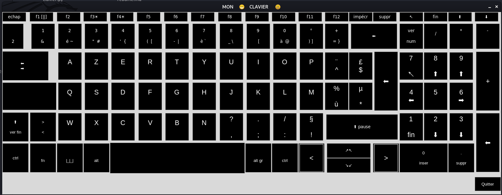

# ⌨️ Clavier

A **visual replica of a full French AZERTY keyboard**, built entirely with Python's `tkinter`. Every key — function row, alphanumeric keys, arrow cluster, numeric pad — is recreated as a styled button in a single window layout.



## 📖 Table of Contents

- [About](#-about)
- [Features](#-features)
- [Interface Overview](#-interface-overview)
- [Installation](#-installation)
- [Usage](#-usage)
- [Code Overview](#-code-overview)
- [Known Limitations](#-known-limitations)
- [Roadmap](#-roadmap)
- [Author](#-author)
- [License](#-license)

## 🎮 About

**Clavier** ("keyboard" in French) is a `tkinter` GUI project that recreates the full visual layout of a physical French AZERTY keyboard — function keys, letter keys with their secondary/tertiary symbols, modifier keys (`ctrl`, `alt`, `alt gr`, `fn`), arrow keys, and the numeric keypad — all laid out on a single grid to mirror a real keyboard's proportions.

It's primarily a **UI/layout exercise**: an exploration of precise grid positioning, button sizing (`width`/`height`), spanning (`columnspan`/`rowspan`), and multi-line button labels in `tkinter`.

## ✨ Features

- 🖥️ Full AZERTY layout reproduced key-by-key, including:
  - Function row (`Échap`, `F1`–`F12`, `Suppr`, `Impécr`, etc.)
  - Number row with secondary characters (`&`, `é~`, `"#`, etc.)
  - Three letter rows (`AZERTY`, `QSDFGH`, `WXCVBN`) with accented/special characters
  - Modifier keys: `Ctrl`, `Alt`, `Alt Gr`, `Fn`, `Shift` (`⬆`)
  - Arrow key cluster and numeric keypad
- 🎨 Dark-themed button styling, consistent with a real keyboard's look
- 🚪 Working `Quitter` (Quit) button to close the application
- 🧱 Modular button-creation helpers (`touches_de_fonction`, `touches_alpha_1`, `touches_alpha_2`) to keep the layout code organized

## 🖼️ Interface Overview

The window is arranged as a large `tkinter` grid, row by row:

- **Row 0** — Function keys (`Échap` → `F12`) and top-right utility keys
- **Row 1** — Number row + Backspace + Numpad `/ * -`
- **Rows 2–4** — The three AZERTY letter rows, each with their arrow/numpad neighbors
- **Row 5** — Bottom row: `Ctrl`, `Fn`, `Alt`, spacebar, `Alt Gr`, arrow keys, numpad `0`/`.`
- **Bottom-right** — `Quitter` button to exit the app

## ⚙️ Installation

No external libraries required — only the Python standard library.

```bash
git clone https://github.com/DonaFidele/clavier.git
cd clavier
```

**Requirements:**
- Python 3.x with `tkinter` installed
  - Linux: `sudo apt-get install python3-tk` if not already present
  - Windows/macOS: included by default with the standard Python installer

## ▶️ Usage

Run the app from your terminal:

```bash
python3 clavier.py
```

A window opens displaying the full keyboard layout. Click **Quitter** to close it.

## 🧠 Code Overview

- Built around a single `Clavier` class extending `tkinter.Tk`.
- Buttons are generated through small helper methods rather than being declared one by one from scratch:
  - `touches_de_fonction()` — small, single-line function-row keys
  - `touches_alpha_1()` — larger keys used for the number row and numpad (support two-line labels for secondary symbols)
  - `touches_alpha_2()` — letter keys, sized for the three main AZERTY rows
  - `quitter()` — creates the Quit button, wired to `self.quit`
- `creer_des_bouttons()` lays out every key by calling these helpers with the exact text, row, and column needed to reproduce the physical keyboard layout.

## ⚠️ Known Limitations

- This is a **visual layout only** — pressing letter/number/function keys does nothing; only the `Quitter` button is functionally wired up.
- Buttons are created but their references aren't stored individually (`self.boutton` gets overwritten each time), so keys can't currently be styled or updated individually after creation.
- Layout was tuned for a specific screen size; on smaller displays some columns may extend past the visible window.

## 🗺️ Roadmap

- [ ] Bind each key to print/simulate its corresponding character (turn this into an actual on-screen keyboard)
- [ ] Add keyboard-driven highlighting (physical key press lights up the matching on-screen button)
- [ ] Store button references in a dictionary instead of overwriting `self.boutton`
- [ ] Make the layout responsive to window resizing

## 👤 Author

**DonaFidele**
[GitHub Profile](https://github.com/DonaFidele)

## 📄 License

Free to fork and contribute.

---

<p align="center">Made with ⌨️🧠 by <b>Dona😎</b></p>
